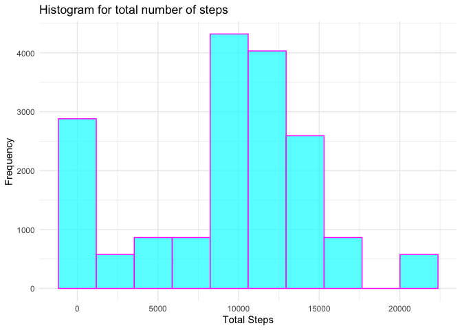
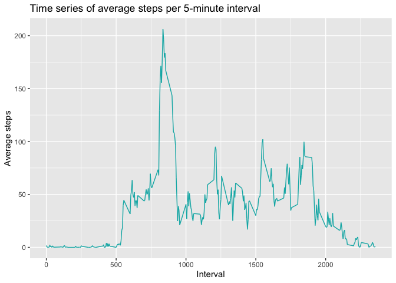
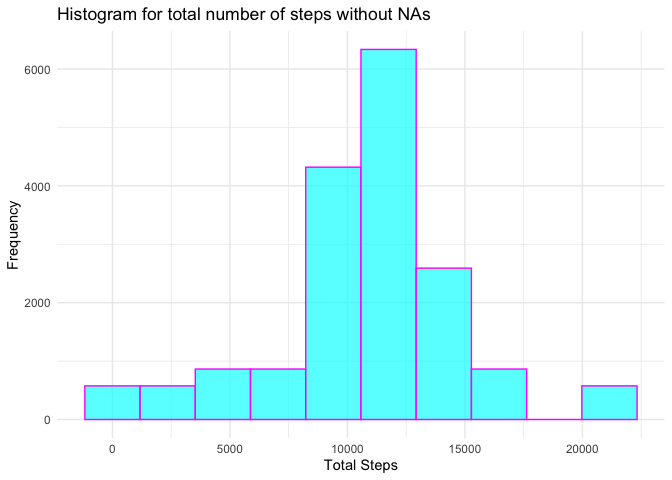
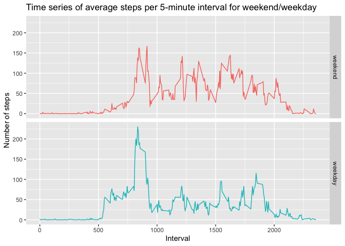

```r
library(data.table)
library(tidyr)
library(ggplot2)
library(dplyr)
```

```
## 
## Attaching package: 'dplyr'
```

```
## The following objects are masked from 'package:data.table':
## 
##     between, first, last
```

```
## The following objects are masked from 'package:stats':
## 
##     filter, lag
```

```
## The following objects are masked from 'package:base':
## 
##     intersect, setdiff, setequal, union
```

## Loading and preprocessing the data
1. If the data file does not exist, unzip the activity.zip to get it.
2. Read the activity.csv file and convert the data.frame into tibble.
3. Format the dates in the 2nd column into Date objects.

```r
filename <- "activity.csv"
if (!file.exists(filename)){
    unzip("activity.zip")
}
activity <- read.csv(filename)
activity <- as_tibble(activity)
activity$date <- as.Date(activity$date, format="%Y-%m-%d")
```

## What is mean total number of steps taken per day?
Create histogram with total number of steps:

```r
activity <- activity %>% 
    group_by(date) %>% 
    mutate(total_daily_steps=sum(steps, na.rm=TRUE))
ggplot(activity, aes(total_daily_steps)) + 
    geom_histogram(col="magenta", fill="cyan", alpha=3/4, bins=10) + theme_minimal() +
    labs(x="Total Steps", y="Frequency", title="Histogram for total number of steps")
```

<!-- -->

Mean number of steps per day:

```r
activity <- activity %>% 
    group_by(date) %>% 
    mutate(mean_daily_steps=mean(steps, na.rm=TRUE))
activity %>% 
    group_by(date) %>% 
    select(mean_daily_steps) %>% 
    distinct() %>% 
    print(n=Inf)
```

```
## Adding missing grouping variables: `date`
```

```
## # A tibble: 61 x 2
## # Groups:   date [61]
##    date       mean_daily_steps
##    <date>                <dbl>
##  1 2012-10-01          NaN    
##  2 2012-10-02            0.438
##  3 2012-10-03           39.4  
##  4 2012-10-04           42.1  
##  5 2012-10-05           46.2  
##  6 2012-10-06           53.5  
##  7 2012-10-07           38.2  
##  8 2012-10-08          NaN    
##  9 2012-10-09           44.5  
## 10 2012-10-10           34.4  
## 11 2012-10-11           35.8  
## 12 2012-10-12           60.4  
## 13 2012-10-13           43.1  
## 14 2012-10-14           52.4  
## 15 2012-10-15           35.2  
## 16 2012-10-16           52.4  
## 17 2012-10-17           46.7  
## 18 2012-10-18           34.9  
## 19 2012-10-19           41.1  
## 20 2012-10-20           36.1  
## 21 2012-10-21           30.6  
## 22 2012-10-22           46.7  
## 23 2012-10-23           31.0  
## 24 2012-10-24           29.0  
## 25 2012-10-25            8.65 
## 26 2012-10-26           23.5  
## 27 2012-10-27           35.1  
## 28 2012-10-28           39.8  
## 29 2012-10-29           17.4  
## 30 2012-10-30           34.1  
## 31 2012-10-31           53.5  
## 32 2012-11-01          NaN    
## 33 2012-11-02           36.8  
## 34 2012-11-03           36.7  
## 35 2012-11-04          NaN    
## 36 2012-11-05           36.2  
## 37 2012-11-06           28.9  
## 38 2012-11-07           44.7  
## 39 2012-11-08           11.2  
## 40 2012-11-09          NaN    
## 41 2012-11-10          NaN    
## 42 2012-11-11           43.8  
## 43 2012-11-12           37.4  
## 44 2012-11-13           25.5  
## 45 2012-11-14          NaN    
## 46 2012-11-15            0.142
## 47 2012-11-16           18.9  
## 48 2012-11-17           49.8  
## 49 2012-11-18           52.5  
## 50 2012-11-19           30.7  
## 51 2012-11-20           15.5  
## 52 2012-11-21           44.4  
## 53 2012-11-22           70.9  
## 54 2012-11-23           73.6  
## 55 2012-11-24           50.3  
## 56 2012-11-25           41.1  
## 57 2012-11-26           38.8  
## 58 2012-11-27           47.4  
## 59 2012-11-28           35.4  
## 60 2012-11-29           24.5  
## 61 2012-11-30          NaN
```

Median number of steps per day:

```r
activity <- activity %>% 
    group_by(date) %>% 
    mutate(median_daily_steps=median(steps, na.rm=TRUE))
activity %>% 
    group_by(date) %>% 
    select(median_daily_steps) %>% 
    distinct() %>% 
    print(n=Inf)
```

```
## Adding missing grouping variables: `date`
```

```
## # A tibble: 61 x 2
## # Groups:   date [61]
##    date       median_daily_steps
##    <date>                  <dbl>
##  1 2012-10-01                 NA
##  2 2012-10-02                  0
##  3 2012-10-03                  0
##  4 2012-10-04                  0
##  5 2012-10-05                  0
##  6 2012-10-06                  0
##  7 2012-10-07                  0
##  8 2012-10-08                 NA
##  9 2012-10-09                  0
## 10 2012-10-10                  0
## 11 2012-10-11                  0
## 12 2012-10-12                  0
## 13 2012-10-13                  0
## 14 2012-10-14                  0
## 15 2012-10-15                  0
## 16 2012-10-16                  0
## 17 2012-10-17                  0
## 18 2012-10-18                  0
## 19 2012-10-19                  0
## 20 2012-10-20                  0
## 21 2012-10-21                  0
## 22 2012-10-22                  0
## 23 2012-10-23                  0
## 24 2012-10-24                  0
## 25 2012-10-25                  0
## 26 2012-10-26                  0
## 27 2012-10-27                  0
## 28 2012-10-28                  0
## 29 2012-10-29                  0
## 30 2012-10-30                  0
## 31 2012-10-31                  0
## 32 2012-11-01                 NA
## 33 2012-11-02                  0
## 34 2012-11-03                  0
## 35 2012-11-04                 NA
## 36 2012-11-05                  0
## 37 2012-11-06                  0
## 38 2012-11-07                  0
## 39 2012-11-08                  0
## 40 2012-11-09                 NA
## 41 2012-11-10                 NA
## 42 2012-11-11                  0
## 43 2012-11-12                  0
## 44 2012-11-13                  0
## 45 2012-11-14                 NA
## 46 2012-11-15                  0
## 47 2012-11-16                  0
## 48 2012-11-17                  0
## 49 2012-11-18                  0
## 50 2012-11-19                  0
## 51 2012-11-20                  0
## 52 2012-11-21                  0
## 53 2012-11-22                  0
## 54 2012-11-23                  0
## 55 2012-11-24                  0
## 56 2012-11-25                  0
## 57 2012-11-26                  0
## 58 2012-11-27                  0
## 59 2012-11-28                  0
## 60 2012-11-29                  0
## 61 2012-11-30                 NA
```

## What is the average daily activity pattern?
Create time series plot for time intervals:

```r
activity <- activity %>% 
    group_by(interval) %>% 
    mutate(mean_interval_steps=mean(steps, na.rm=TRUE))
ggplot(activity, aes(interval, mean_interval_steps)) +
    geom_line(color=rgb(0, 0.7, 0.7)) + 
#    geom_point(na.rm=TRUE, color=rgb(0, 0.7, 0.7), pch=20) +
    labs(x="Interval", y="Average steps",
    title="Time series of average steps per 5-minute interval")
```

<!-- -->

Interval with the maximum average number of steps:

```r
activity$interval[which.max(activity$mean_interval_steps)]
```

```
## [1] 835
```

## Imputing missing values
Calculate number of rows with missing values (NA):

```r
sum(is.na(activity$steps))
```

```
## [1] 2304
```

Calculate percentage of rows with missing values (NA):

```r
mean(is.na(activity$steps))
```

```
## [1] 0.1311475
```

Replace NA values for steps with mean_interval_steps values:

```r
new_activity <- activity %>% 
    mutate(steps=ifelse(is.na(steps), mean_interval_steps, steps)) 
```

Recalculate total steps per day for new dataset:

```r
new_activity <- new_activity %>% 
    group_by(date) %>% 
    mutate(total_daily_steps=sum(steps, na.rm=TRUE))
ggplot(new_activity, aes(total_daily_steps)) + 
    geom_histogram(col="magenta", fill="cyan", alpha=3/4, bins=10) + theme_minimal() +
    labs(x="Total Steps", y="Frequency", title="Histogram for total number of steps without NAs")
```

<!-- -->

Recalculate mean number of steps per day for new dataset:

```r
new_activity <- new_activity %>% 
    group_by(date) %>% 
    mutate(mean_daily_steps=mean(steps, na.rm=TRUE))
new_activity %>% 
    group_by(date) %>% 
    select(mean_daily_steps) %>% 
    distinct() %>% 
    print(n=Inf)
```

```
## Adding missing grouping variables: `date`
```

```
## # A tibble: 61 x 2
## # Groups:   date [61]
##    date       mean_daily_steps
##    <date>                <dbl>
##  1 2012-10-01           37.4  
##  2 2012-10-02            0.438
##  3 2012-10-03           39.4  
##  4 2012-10-04           42.1  
##  5 2012-10-05           46.2  
##  6 2012-10-06           53.5  
##  7 2012-10-07           38.2  
##  8 2012-10-08           37.4  
##  9 2012-10-09           44.5  
## 10 2012-10-10           34.4  
## 11 2012-10-11           35.8  
## 12 2012-10-12           60.4  
## 13 2012-10-13           43.1  
## 14 2012-10-14           52.4  
## 15 2012-10-15           35.2  
## 16 2012-10-16           52.4  
## 17 2012-10-17           46.7  
## 18 2012-10-18           34.9  
## 19 2012-10-19           41.1  
## 20 2012-10-20           36.1  
## 21 2012-10-21           30.6  
## 22 2012-10-22           46.7  
## 23 2012-10-23           31.0  
## 24 2012-10-24           29.0  
## 25 2012-10-25            8.65 
## 26 2012-10-26           23.5  
## 27 2012-10-27           35.1  
## 28 2012-10-28           39.8  
## 29 2012-10-29           17.4  
## 30 2012-10-30           34.1  
## 31 2012-10-31           53.5  
## 32 2012-11-01           37.4  
## 33 2012-11-02           36.8  
## 34 2012-11-03           36.7  
## 35 2012-11-04           37.4  
## 36 2012-11-05           36.2  
## 37 2012-11-06           28.9  
## 38 2012-11-07           44.7  
## 39 2012-11-08           11.2  
## 40 2012-11-09           37.4  
## 41 2012-11-10           37.4  
## 42 2012-11-11           43.8  
## 43 2012-11-12           37.4  
## 44 2012-11-13           25.5  
## 45 2012-11-14           37.4  
## 46 2012-11-15            0.142
## 47 2012-11-16           18.9  
## 48 2012-11-17           49.8  
## 49 2012-11-18           52.5  
## 50 2012-11-19           30.7  
## 51 2012-11-20           15.5  
## 52 2012-11-21           44.4  
## 53 2012-11-22           70.9  
## 54 2012-11-23           73.6  
## 55 2012-11-24           50.3  
## 56 2012-11-25           41.1  
## 57 2012-11-26           38.8  
## 58 2012-11-27           47.4  
## 59 2012-11-28           35.4  
## 60 2012-11-29           24.5  
## 61 2012-11-30           37.4
```

Recalculate median number of steps per day for new dataset:

```r
new_activity <- new_activity %>% 
    group_by(date) %>% 
    mutate(median_daily_steps=median(steps, na.rm=TRUE))
new_activity %>% 
    group_by(date) %>% 
    select(median_daily_steps) %>% 
    distinct() %>% 
    print(n=Inf)
```

```
## Adding missing grouping variables: `date`
```

```
## # A tibble: 61 x 2
## # Groups:   date [61]
##    date       median_daily_steps
##    <date>                  <dbl>
##  1 2012-10-01               34.1
##  2 2012-10-02                0  
##  3 2012-10-03                0  
##  4 2012-10-04                0  
##  5 2012-10-05                0  
##  6 2012-10-06                0  
##  7 2012-10-07                0  
##  8 2012-10-08               34.1
##  9 2012-10-09                0  
## 10 2012-10-10                0  
## 11 2012-10-11                0  
## 12 2012-10-12                0  
## 13 2012-10-13                0  
## 14 2012-10-14                0  
## 15 2012-10-15                0  
## 16 2012-10-16                0  
## 17 2012-10-17                0  
## 18 2012-10-18                0  
## 19 2012-10-19                0  
## 20 2012-10-20                0  
## 21 2012-10-21                0  
## 22 2012-10-22                0  
## 23 2012-10-23                0  
## 24 2012-10-24                0  
## 25 2012-10-25                0  
## 26 2012-10-26                0  
## 27 2012-10-27                0  
## 28 2012-10-28                0  
## 29 2012-10-29                0  
## 30 2012-10-30                0  
## 31 2012-10-31                0  
## 32 2012-11-01               34.1
## 33 2012-11-02                0  
## 34 2012-11-03                0  
## 35 2012-11-04               34.1
## 36 2012-11-05                0  
## 37 2012-11-06                0  
## 38 2012-11-07                0  
## 39 2012-11-08                0  
## 40 2012-11-09               34.1
## 41 2012-11-10               34.1
## 42 2012-11-11                0  
## 43 2012-11-12                0  
## 44 2012-11-13                0  
## 45 2012-11-14               34.1
## 46 2012-11-15                0  
## 47 2012-11-16                0  
## 48 2012-11-17                0  
## 49 2012-11-18                0  
## 50 2012-11-19                0  
## 51 2012-11-20                0  
## 52 2012-11-21                0  
## 53 2012-11-22                0  
## 54 2012-11-23                0  
## 55 2012-11-24                0  
## 56 2012-11-25                0  
## 57 2012-11-26                0  
## 58 2012-11-27                0  
## 59 2012-11-28                0  
## 60 2012-11-29                0  
## 61 2012-11-30               34.1
```

## Are there differences in activity patterns between weekdays and weekends?
Create a factor for weekday/weekend and add it to the new_activity data:

```r
new_activity$day <- factor(weekdays(new_activity$date), 
    levels=c("Sunday", "Monday", "Tuesday", "Wednesday", "Thursday", "Friday", "Saturday"), 
    labels=c("weekend", "weekday", "weekday", "weekday", "weekday", "weekday", "weekend"))
```

Recalculate mean number of steps for each interval and create panel plot for weekday/weekend steps:

```r
new_activity <- new_activity %>% 
    group_by(interval, day) %>% 
    mutate(mean_interval_steps=mean(steps, na.rm=TRUE))
ggplot(new_activity, aes(interval, mean_interval_steps, color=day)) +
    geom_line() +
#    geom_point(na.rm=TRUE, color=rgb(0, 0.7, 0.7), pch=20) +
    labs(x="Interval", y="Number of steps",
    title="Time series of average steps per 5-minute interval for weekend/weekday") + 
    facet_grid(day~.) + theme(legend.position="none")
```

<!-- -->

Clean the session:

```r
rm(activity)
rm(new_activity)
file.remove(filename)
```

```
## [1] TRUE
```

```r
rm(filename)
detach("package:data.table", unload=TRUE)
detach("package:tidyr", unload=TRUE)
detach("package:ggplot2", unload=TRUE)
detach("package:dplyr", unload=TRUE)
```
