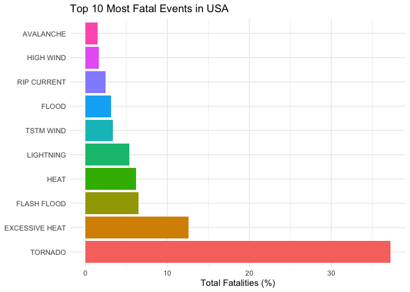
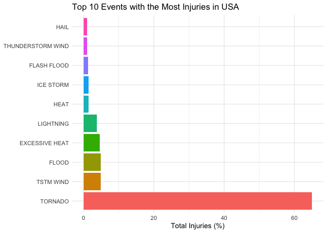
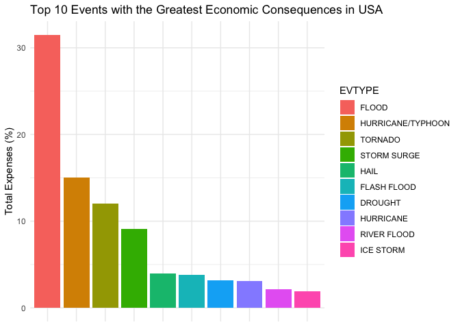

## Summary
In this document we will explore the U.S. National Oceanic and Atmospheric 
Administration's (NOAA) storm database. The NOAA database tracks characteristics 
of major storms and weather events in the United States, including when and where 
they occur, as well as estimates of any fatalities, injuries, and property damage.
The recorded events in the NOAA database took place between 1950 and 2011. In the 
earlier years of the database there are generally fewer events recorded, most 
likely due to a lack of good records, but more recent years should be considered 
more complete. By analyzing the data, we found that tornadoes are responsible
for the majority of the deaths (37.2%) and injuries (65%), compared to all the 
other events that are included in the database. As regards the costs of the 
damages, we discovered that floods had the greatest economic (most expensive) 
consequences, surpassing all other events with a significant 31.5% of the total 
damage costs. However, to make any suggestions we would need to analyse more 
recent events (2011-2020) as many things have changed since 2011.

## Requirements:
Load necessary libraries:

```r
library(data.table)
library(tidyr)
library(ggplot2)
library(dplyr)
```

```
## 
## Attaching package: 'dplyr'
```

```
## The following objects are masked from 'package:data.table':
## 
##     between, first, last
```

```
## The following objects are masked from 'package:stats':
## 
##     filter, lag
```

```
## The following objects are masked from 'package:base':
## 
##     intersect, setdiff, setequal, union
```

```r
library(lubridate)
```

```
## 
## Attaching package: 'lubridate'
```

```
## The following objects are masked from 'package:data.table':
## 
##     hour, isoweek, mday, minute, month, quarter, second, wday, week,
##     yday, year
```

```
## The following objects are masked from 'package:base':
## 
##     date, intersect, setdiff, union
```

```r
library(R.utils)
```

```
## Loading required package: R.oo
```

```
## Loading required package: R.methodsS3
```

```
## R.methodsS3 v1.8.0 (2020-02-14 07:10:20 UTC) successfully loaded. See ?R.methodsS3 for help.
```

```
## R.oo v1.23.0 successfully loaded. See ?R.oo for help.
```

```
## 
## Attaching package: 'R.oo'
```

```
## The following object is masked from 'package:R.methodsS3':
## 
##     throw
```

```
## The following objects are masked from 'package:methods':
## 
##     getClasses, getMethods
```

```
## The following objects are masked from 'package:base':
## 
##     attach, detach, load, save
```

```
## R.utils v2.9.2 successfully loaded. See ?R.utils for help.
```

```
## 
## Attaching package: 'R.utils'
```

```
## The following object is masked from 'package:tidyr':
## 
##     extract
```

```
## The following object is masked from 'package:utils':
## 
##     timestamp
```

```
## The following objects are masked from 'package:base':
## 
##     cat, commandArgs, getOption, inherits, isOpen, nullfile, parse,
##     warnings
```

Display session info:

```r
sessionInfo()
```

```
## R version 4.0.2 (2020-06-22)
## Platform: x86_64-apple-darwin17.0 (64-bit)
## Running under: macOS Catalina 10.15.6
## 
## Matrix products: default
## BLAS:   /Library/Frameworks/R.framework/Versions/4.0/Resources/lib/libRblas.dylib
## LAPACK: /Library/Frameworks/R.framework/Versions/4.0/Resources/lib/libRlapack.dylib
## 
## locale:
## [1] en_US.UTF-8/en_US.UTF-8/en_US.UTF-8/C/en_US.UTF-8/en_US.UTF-8
## 
## attached base packages:
## [1] stats     graphics  grDevices utils     datasets  methods   base     
## 
## other attached packages:
## [1] lubridate_1.7.9   dplyr_1.0.1       ggplot2_3.3.2     tidyr_1.1.1      
## [5] data.table_1.13.0
## 
## loaded via a namespace (and not attached):
##  [1] Rcpp_1.0.5       knitr_1.29       magrittr_1.5     munsell_0.5.0   
##  [5] tidyselect_1.1.0 colorspace_1.4-1 R6_2.4.1         rlang_0.4.7     
##  [9] stringr_1.4.0    tools_4.0.2      grid_4.0.2       gtable_0.3.0    
## [13] xfun_0.16        withr_2.2.0      htmltools_0.5.0  ellipsis_0.3.1  
## [17] yaml_2.2.1       digest_0.6.25    tibble_3.0.3     lifecycle_0.2.0 
## [21] crayon_1.3.4     purrr_0.3.4      vctrs_0.3.2      glue_1.4.1      
## [25] evaluate_0.14    rmarkdown_2.3    stringi_1.4.6    compiler_4.0.2  
## [29] pillar_1.4.6     scales_1.1.1     generics_0.0.2   pkgconfig_2.0.3
```

## Data Processing
1. Read the data from the url, no need to download it.
2. Convert dataframe to tibble for easier handling.
3. Convert the BGN_DATE to date object.
4. Create a new column with the date and time using BGN_DATE and BGN_TIME columns.

```r
url <- "https://d396qusza40orc.cloudfront.net/repdata%2Fdata%2FStormData.csv.bz2"
storm_data <- fread(url)
storm_data <- as_tibble(storm_data)
storm_data$BGN_DATE <- as.Date(storm_data$BGN_DATE, format="%m/%d/%Y")
storm_data$Time <- as_datetime(paste(storm_data$BGN_DATE, storm_data$BGN_TIME), 
                               format="%Y-%m-%d %H%M")
```

## Exploratory Data Analysis (EDA)
Let's take a look at the data:

```r
str(storm_data)
```

```
## tibble [902,297 × 38] (S3: tbl_df/tbl/data.frame)
##  $ STATE__   : num [1:902297] 1 1 1 1 1 1 1 1 1 1 ...
##  $ BGN_DATE  : Date[1:902297], format: "1950-04-18" "1950-04-18" ...
##  $ BGN_TIME  : chr [1:902297] "0130" "0145" "1600" "0900" ...
##  $ TIME_ZONE : chr [1:902297] "CST" "CST" "CST" "CST" ...
##  $ COUNTY    : num [1:902297] 97 3 57 89 43 77 9 123 125 57 ...
##  $ COUNTYNAME: chr [1:902297] "MOBILE" "BALDWIN" "FAYETTE" "MADISON" ...
##  $ STATE     : chr [1:902297] "AL" "AL" "AL" "AL" ...
##  $ EVTYPE    : chr [1:902297] "TORNADO" "TORNADO" "TORNADO" "TORNADO" ...
##  $ BGN_RANGE : num [1:902297] 0 0 0 0 0 0 0 0 0 0 ...
##  $ BGN_AZI   : chr [1:902297] "" "" "" "" ...
##  $ BGN_LOCATI: chr [1:902297] "" "" "" "" ...
##  $ END_DATE  : chr [1:902297] "" "" "" "" ...
##  $ END_TIME  : chr [1:902297] "" "" "" "" ...
##  $ COUNTY_END: num [1:902297] 0 0 0 0 0 0 0 0 0 0 ...
##  $ COUNTYENDN: logi [1:902297] NA NA NA NA NA NA ...
##  $ END_RANGE : num [1:902297] 0 0 0 0 0 0 0 0 0 0 ...
##  $ END_AZI   : chr [1:902297] "" "" "" "" ...
##  $ END_LOCATI: chr [1:902297] "" "" "" "" ...
##  $ LENGTH    : num [1:902297] 14 2 0.1 0 0 1.5 1.5 0 3.3 2.3 ...
##  $ WIDTH     : num [1:902297] 100 150 123 100 150 177 33 33 100 100 ...
##  $ F         : int [1:902297] 3 2 2 2 2 2 2 1 3 3 ...
##  $ MAG       : num [1:902297] 0 0 0 0 0 0 0 0 0 0 ...
##  $ FATALITIES: num [1:902297] 0 0 0 0 0 0 0 0 1 0 ...
##  $ INJURIES  : num [1:902297] 15 0 2 2 2 6 1 0 14 0 ...
##  $ PROPDMG   : num [1:902297] 25 2.5 25 2.5 2.5 2.5 2.5 2.5 25 25 ...
##  $ PROPDMGEXP: chr [1:902297] "K" "K" "K" "K" ...
##  $ CROPDMG   : num [1:902297] 0 0 0 0 0 0 0 0 0 0 ...
##  $ CROPDMGEXP: chr [1:902297] "" "" "" "" ...
##  $ WFO       : chr [1:902297] "" "" "" "" ...
##  $ STATEOFFIC: chr [1:902297] "" "" "" "" ...
##  $ ZONENAMES : chr [1:902297] "" "" "" "" ...
##  $ LATITUDE  : num [1:902297] 3040 3042 3340 3458 3412 ...
##  $ LONGITUDE : num [1:902297] 8812 8755 8742 8626 8642 ...
##  $ LATITUDE_E: num [1:902297] 3051 0 0 0 0 ...
##  $ LONGITUDE_: num [1:902297] 8806 0 0 0 0 ...
##  $ REMARKS   : chr [1:902297] "" "" "" "" ...
##  $ REFNUM    : num [1:902297] 1 2 3 4 5 6 7 8 9 10 ...
##  $ Time      : POSIXct[1:902297], format: "1950-04-18 01:30:00" "1950-04-18 01:45:00" ...
##  - attr(*, ".internal.selfref")=<externalptr>
```

```r
summary(storm_data)
```

```
##     STATE__        BGN_DATE            BGN_TIME          TIME_ZONE        
##  Min.   : 1.0   Min.   :1950-01-03   Length:902297      Length:902297     
##  1st Qu.:19.0   1st Qu.:1995-04-20   Class :character   Class :character  
##  Median :30.0   Median :2002-03-18   Mode  :character   Mode  :character  
##  Mean   :31.2   Mean   :1998-12-27                                        
##  3rd Qu.:45.0   3rd Qu.:2007-07-28                                        
##  Max.   :95.0   Max.   :2011-11-30                                        
##                                                                           
##      COUNTY       COUNTYNAME           STATE              EVTYPE         
##  Min.   :  0.0   Length:902297      Length:902297      Length:902297     
##  1st Qu.: 31.0   Class :character   Class :character   Class :character  
##  Median : 75.0   Mode  :character   Mode  :character   Mode  :character  
##  Mean   :100.6                                                           
##  3rd Qu.:131.0                                                           
##  Max.   :873.0                                                           
##                                                                          
##    BGN_RANGE          BGN_AZI           BGN_LOCATI          END_DATE        
##  Min.   :   0.000   Length:902297      Length:902297      Length:902297     
##  1st Qu.:   0.000   Class :character   Class :character   Class :character  
##  Median :   0.000   Mode  :character   Mode  :character   Mode  :character  
##  Mean   :   1.484                                                           
##  3rd Qu.:   1.000                                                           
##  Max.   :3749.000                                                           
##                                                                             
##    END_TIME           COUNTY_END COUNTYENDN       END_RANGE       
##  Length:902297      Min.   :0    Mode:logical   Min.   :  0.0000  
##  Class :character   1st Qu.:0    NA's:902297    1st Qu.:  0.0000  
##  Mode  :character   Median :0                   Median :  0.0000  
##                     Mean   :0                   Mean   :  0.9862  
##                     3rd Qu.:0                   3rd Qu.:  0.0000  
##                     Max.   :0                   Max.   :925.0000  
##                                                                   
##    END_AZI           END_LOCATI            LENGTH              WIDTH         
##  Length:902297      Length:902297      Min.   :   0.0000   Min.   :   0.000  
##  Class :character   Class :character   1st Qu.:   0.0000   1st Qu.:   0.000  
##  Mode  :character   Mode  :character   Median :   0.0000   Median :   0.000  
##                                        Mean   :   0.2301   Mean   :   7.503  
##                                        3rd Qu.:   0.0000   3rd Qu.:   0.000  
##                                        Max.   :2315.0000   Max.   :4400.000  
##                                                                              
##        F               MAG            FATALITIES          INJURIES        
##  Min.   :0.0      Min.   :    0.0   Min.   :  0.0000   Min.   :   0.0000  
##  1st Qu.:0.0      1st Qu.:    0.0   1st Qu.:  0.0000   1st Qu.:   0.0000  
##  Median :1.0      Median :   50.0   Median :  0.0000   Median :   0.0000  
##  Mean   :0.9      Mean   :   46.9   Mean   :  0.0168   Mean   :   0.1557  
##  3rd Qu.:1.0      3rd Qu.:   75.0   3rd Qu.:  0.0000   3rd Qu.:   0.0000  
##  Max.   :5.0      Max.   :22000.0   Max.   :583.0000   Max.   :1700.0000  
##  NA's   :843563                                                           
##     PROPDMG         PROPDMGEXP           CROPDMG         CROPDMGEXP       
##  Min.   :   0.00   Length:902297      Min.   :  0.000   Length:902297     
##  1st Qu.:   0.00   Class :character   1st Qu.:  0.000   Class :character  
##  Median :   0.00   Mode  :character   Median :  0.000   Mode  :character  
##  Mean   :  12.06                      Mean   :  1.527                     
##  3rd Qu.:   0.50                      3rd Qu.:  0.000                     
##  Max.   :5000.00                      Max.   :990.000                     
##                                                                           
##      WFO             STATEOFFIC         ZONENAMES            LATITUDE   
##  Length:902297      Length:902297      Length:902297      Min.   :   0  
##  Class :character   Class :character   Class :character   1st Qu.:2802  
##  Mode  :character   Mode  :character   Mode  :character   Median :3540  
##                                                           Mean   :2875  
##                                                           3rd Qu.:4019  
##                                                           Max.   :9706  
##                                                           NA's   :47    
##    LONGITUDE        LATITUDE_E     LONGITUDE_       REMARKS         
##  Min.   :-14451   Min.   :   0   Min.   :-14455   Length:902297     
##  1st Qu.:  7247   1st Qu.:   0   1st Qu.:     0   Class :character  
##  Median :  8707   Median :   0   Median :     0   Mode  :character  
##  Mean   :  6940   Mean   :1452   Mean   :  3509                     
##  3rd Qu.:  9605   3rd Qu.:3549   3rd Qu.:  8735                     
##  Max.   : 17124   Max.   :9706   Max.   :106220                     
##                   NA's   :40                                        
##      REFNUM            Time                    
##  Min.   :     1   Min.   :1950-01-03 11:00:00  
##  1st Qu.:225575   1st Qu.:1976-06-11 23:45:00  
##  Median :451149   Median :1986-08-16 23:10:00  
##  Mean   :451149   Mean   :1983-09-06 11:15:43  
##  3rd Qu.:676723   3rd Qu.:1992-09-22 02:55:00  
##  Max.   :902297   Max.   :1995-12-31 20:00:00  
##                   NA's   :653536
```

## Results
### Harmful events
To find which events have the most harmful impact on the population we have to
use the FATALITIES and INJURIES columns.

```r
harmful_events <- storm_data %>% 
    select(EVTYPE, FATALITIES, INJURIES) %>% 
    group_by(EVTYPE) %>% 
    mutate(Total_Fatal=sum(FATALITIES), Total_Inj=sum(INJURIES)) %>% 
    select(EVTYPE, Total_Fatal, Total_Inj) %>% 
    distinct() 
```

Now let's calculate the sum and the percentage of fatalities and injuries, in 
order to better understand the impact of each event. This is also a form of 
normalization that is applied on the total values.

```r
sum_fatal <- sum(harmful_events$Total_Fatal)
fatal_events <- harmful_events %>% 
    arrange(desc(Total_Fatal), desc(Total_Inj)) %>%
    mutate(Prop_Fatal=Total_Fatal / sum_fatal * 100)

sum_inj <- sum(harmful_events$Total_Inj)
injury_events <- harmful_events %>% 
    arrange(desc(Total_Inj), desc(Total_Fatal)) %>%
    mutate(Prop_Inj=Total_Inj / sum_inj * 100)
```

It's time to plot our data! We will use only the top 10 top events according to
fatalities and injuries, since these are the most harmful events and plotting 
everything would be too messy and pointless.

```r
fatal_events$EVTYPE <- with(fatal_events, reorder(EVTYPE, -Prop_Fatal))
ggplot(fatal_events[1:10, ], aes(EVTYPE, Prop_Fatal, fill=EVTYPE)) + 
    geom_bar(stat="identity") + theme_minimal() + 
    theme(legend.position="none", axis.title.y=element_blank()) +
    labs(y="Total Fatalities (%)", title="Top 10 Most Fatal Events in USA") +
    coord_flip() 
```

<!-- -->

The above plot shows the top 10 most fatal event in USA based on the total
fatalities. In particular, this figure illustrates the percentage of the total
fatalities that corresponds to each event. As we can see, tornado is clearly the
one that caused the most deaths with a whouping 37.19%, excessive heat follows 
with 12.57% and then we have flash flood and heat at 6.46% and 6.19%, respectively.

Below you can see a table with all the corresponding values.

```r
fatal_events[1:10, c("EVTYPE", "Total_Fatal", "Prop_Fatal")]
```

```
## # A tibble: 10 x 3
## # Groups:   EVTYPE [10]
##    EVTYPE         Total_Fatal Prop_Fatal
##    <fct>                <dbl>      <dbl>
##  1 TORNADO               5633      37.2 
##  2 EXCESSIVE HEAT        1903      12.6 
##  3 FLASH FLOOD            978       6.46
##  4 HEAT                   937       6.19
##  5 LIGHTNING              816       5.39
##  6 TSTM WIND              504       3.33
##  7 FLOOD                  470       3.10
##  8 RIP CURRENT            368       2.43
##  9 HIGH WIND              248       1.64
## 10 AVALANCHE              224       1.48
```


```r
injury_events$EVTYPE <- with(injury_events, reorder(EVTYPE, -Prop_Inj))
ggplot(injury_events[1:10, ], aes(EVTYPE, Prop_Inj, fill=EVTYPE)) + 
    geom_bar(stat="identity") + theme_minimal() + 
    theme(legend.position="none", axis.title.y=element_blank()) +
    labs(y="Total Injuries (%)", title="Top 10 Events with the Most Injuries in USA") +
    coord_flip()
```

<!-- -->

The above barplot illustrates the top 10 events that caused the most injuries in
USE. The values were normalized in order to show the proportions of the total
injuries that took place for each event. It is obvious that tornado was responsible 
for the majority of injuries, which corresponds to approximately 65% of the total
injuries. TSTM wind, flood and excessive heat follow, with 4.95%, 4.83% and 4.64%,
respectively.

The corresponding values can be found below.

```r
injury_events[1:10, c("EVTYPE", "Total_Inj", "Prop_Inj")]
```

```
## # A tibble: 10 x 3
## # Groups:   EVTYPE [10]
##    EVTYPE            Total_Inj Prop_Inj
##    <fct>                 <dbl>    <dbl>
##  1 TORNADO               91346   65.0  
##  2 TSTM WIND              6957    4.95 
##  3 FLOOD                  6789    4.83 
##  4 EXCESSIVE HEAT         6525    4.64 
##  5 LIGHTNING              5230    3.72 
##  6 HEAT                   2100    1.49 
##  7 ICE STORM              1975    1.41 
##  8 FLASH FLOOD            1777    1.26 
##  9 THUNDERSTORM WIND      1488    1.06 
## 10 HAIL                   1361    0.968
```

#### Conclusions about harmful events:
According the above barplots, it seems that the most harmful event in United States
is the Tornado, as it is responsible for about 37.2% of fatalities and the massive 
65% of the total injuries.

### Economic consequences
Now let's see which events have the most economic consequences. To do that we need
to check the PROPDMG and PROPDMGEXP columns to get the propert damage expenses and
the CROPDMG and CROPDMGEXP to get the crop damage expenses. Before adding these
two types of expenses, we must fist calculate the actual values. 

#### Important assumptions:
We assume that "+", "-", "-", "?", "0", and "" have exponent 0 which means that 
the actual value will be equal to the PROPDMG or CROPDMG. For "H", "K", "M", "B" 
we assume that they correspon to hundreds, thousands, millions and billions, 
respectively. For the numbers between 1-8 we assume that these represent the 
exponent with base 10.

```r
calc_value <- function(multiplier, exponent){ 
    v <- sapply(seq_along(exponent), function(x) switch (exponent[x],
        "H" = 10^2,
        "K" = 10^3,
        "M" = 10^6,
        "B" = 10^9,
        "1" = 10,
        "2" = 10^2,
        "3" = 10^3,
        "4" = 10^4,
        "5" = 10^5,
        "6" = 10^6,
        "7" = 10^7,
        "8" = 10^8,
        1 
    ))
    return(multiplier * v)
}
expenses <- storm_data %>%
    select(EVTYPE, PROPDMG, PROPDMGEXP, CROPDMG, CROPDMGEXP) %>% 
    group_by(EVTYPE) %>%
    mutate(prop_expenses=calc_value(PROPDMG, PROPDMGEXP), 
           crop_expenses=calc_value(CROPDMG, CROPDMGEXP),
           Total_Expenses=prop_expenses + crop_expenses,
           Cum_Expenses=sum(Total_Expenses)) %>%
    select(EVTYPE, Cum_Expenses) %>% 
    distinct() %>%
    arrange(desc(Cum_Expenses))
```

It is better to normalise the expenses values so we will calculate the percentages
(proportions) as before.

```r
sum_expenses <- sum(expenses$Cum_Expenses)
costly_events <- expenses %>% 
    mutate(Prop_Expenses=Cum_Expenses / sum_expenses * 100)
```

Let's create a plot with the top 10 events with the greatest economic consequences.

```r
costly_events$EVTYPE <- with(costly_events, reorder(EVTYPE, -Prop_Expenses))
ggplot(costly_events[1:10, ], aes(EVTYPE, Prop_Expenses, fill=EVTYPE)) + 
    geom_bar(stat="identity") + theme_minimal() + 
    theme(axis.title.x=element_blank(), 
          axis.ticks.x=element_blank(), axis.text.x=element_blank()) +
    labs(y="Total Expenses (%)", title="Top 10 Events with the Greatest Economic Consequences in USA")
```

<!-- -->

The above barplot shows the proportions of the total expenses for each type of event.
More specifically, it shows the top 10 events that had the greatest economic consequences,
in terms of property and crops damage costs. Clearly, flood caused the most damages
as it was responsible for approximately 31.50% of the total damages in USA. 
Hurricane/Typhoon and tornado follow with 15.07% and 12.02%, respectively.

Below you can see the corresponding values used in the barplot.

```r
costly_events[1:10, ] 
```

```
## # A tibble: 10 x 3
## # Groups:   EVTYPE [10]
##    EVTYPE             Cum_Expenses Prop_Expenses
##    <fct>                     <dbl>         <dbl>
##  1 FLOOD             150319678257          31.5 
##  2 HURRICANE/TYPHOON  71913712800          15.1 
##  3 TORNADO            57350833958          12.0 
##  4 STORM SURGE        43323541000           9.08
##  5 HAIL               18755905408.          3.93
##  6 FLASH FLOOD        18243991078.          3.82
##  7 DROUGHT            15018672000           3.15
##  8 HURRICANE          14610229010           3.06
##  9 RIVER FLOOD        10148404500           2.13
## 10 ICE STORM           8967041360           1.88
```

#### Conclusions about economic consequences:
Based on the previous plot, it seems that the flood caused the most damages in USA,
with a 31.5%, which is almost one third of the total damages caused by all
types of events. With this finding, we could suggest that further measures should
be taken to protect the properties and crops from flood events, however, further
analysis should be made to check whether this finding applies for the current decade
or only for previous decades.

### Cleanup
Now that we are done let's clean our session:

```r
rm(url)
rm(storm_data)
rm(harmful_events)
rm(fatal_events)
rm(injury_events)
rm(expenses)
rm(costly_events)
rm(sum_expenses)
rm(sum_fatal)
rm(sum_inj)
rm(calc_value)
detach("package:data.table", unload=TRUE)
detach("package:tidyr", unload=TRUE)
detach("package:ggplot2", unload=TRUE)
detach("package:dplyr", unload=TRUE)
detach("package:lubridate", unload=TRUE)
detach("package:R.utils", unload=TRUE)
```

Let's check if we cleaned everything:

```r
ls()
```

```
## character(0)
```
